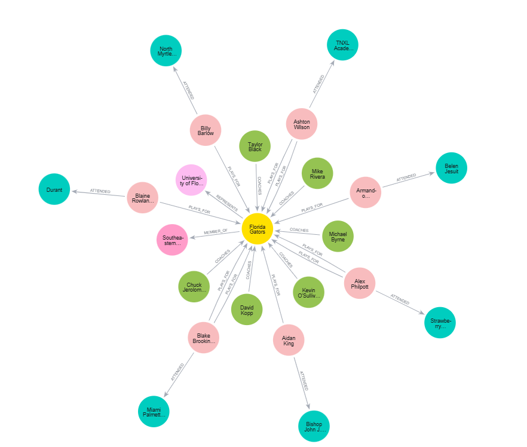
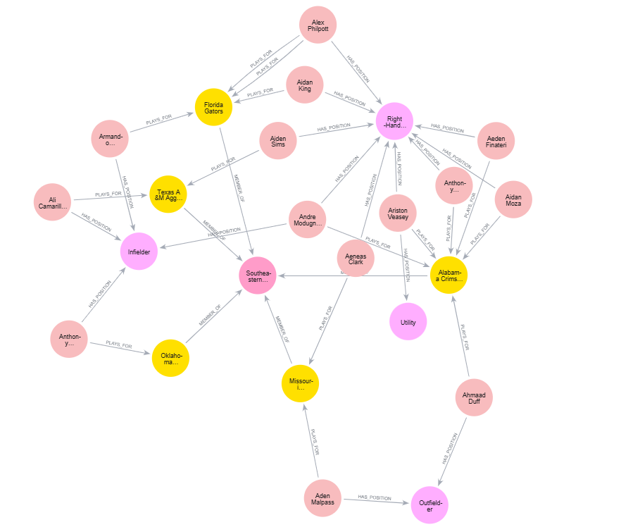

# NCAA Baseball Knowledge Graph  
**Python · ETL · Neo4j · Data Quality Engineering**

This project builds a **college baseball knowledge graph** from publicly available NCAA Division I roster data.

The focus of the project is **end-to-end data engineering**: scraping messy semi-structured data, cleaning and normalizing entities, and modeling relationships in Neo4j to enable reliable, multi-level queries.

## Graph Preview


## Project Components

The project is designed into three main stages:

1. **Data scraping** – automated extraction of roster and coaching staff data from school websites.
2. **ETL & normalization** – cleaning, deduplication, and standardization of raw data into structured tables.
3. **Knowledge graph construction** – loading entities and relationships into Neo4j with enforced constraints.

The pipeline takes raw HTML → produces cleaned CSVs → builds a connected graph of players, coaches, teams, colleges, conferences, and high schools.

## Tech Stack

- **Python** – scraping, ETL, validation
- **Neo4j** – graph database
- **Cypher** – schema design and querying
- **BeautifulSoup / requests** – HTML parsing
- **pandas** – data transformation
- **rapidfuzz** – fuzzy matching for deduplication

## Project Workflow

```text
Step 1: Web Scraping          Step 2: ETL & Normalization        Step 3: Neo4j Loading
┌───────────────────────┐    ┌───────────────────────────┐     ┌──────────────────────────┐
│ Python (requests, bs4)│ →  │ Cleaning & standardization │ →   │ Nodes + relationships     │
│ HTML roster pages     │    │ Deduplication & validation │     │ Constraints & indexing    │
└───────────────────────┘    └───────────────────────────┘     └──────────────────────────┘

```

## Repository Structure

```text
diamond-knowledge-graph/
├── scraper.py                  # scrape roster and staff data
├── process_data.py             # ETL: cleaning, normalization, deduplication
├── funcs_neo4j.py              # Neo4j loader and graph construction
│
├── data/
│   ├── raw/                    # raw scraped CSVs
│   └── processed/              # cleaned, standardized CSVs
│
├── notebooks/
│   └── explore_data.ipynb      # EDA and validation checks
└── README.md

```

## Data Scraping

- Scrapes roster and staff pages using `requests` and `BeautifulSoup`
- Writes **raw, unmodified CSVs** to `data/raw/` to preserve source-of-truth data
- Scraping and CSV output handled in `scraper.py`

## ETL & Data Normalization

The ETL pipeline (`process_data.py`) focuses on **data quality and consistency**.

Key steps include:

- **High school deduplication**
  - Uses fuzzy matching (`rapidfuzz`) to consolidate variant names into canonical entities

- **Position normalization**
  - Maps abbreviations (`OF`, `INF`, `RHP`, `UTIL`) to standardized position names

- **Coach role extraction**
  - Parses free-text titles into canonical role lists

- **Hometown standardization**
  - Normalizes state formats  
    (e.g., `"Fla"` → `"FL"`)

- **Class year & batting/throwing normalization**

Cleaned outputs are written to `data/processed/` and used for graph loading.

## Knowledge Graph Construction (Neo4j)

The graph is built using `funcs_neo4j.py`.

### Nodes

- Player  
- Coach  
- Team  
- College  
- Conference  
- HighSchool  
- Position  

### Relationships

- `(:Player)-[:PLAYS_FOR]->(:Team)`
- `(:Player)-[:ATTENDED]->(:HighSchool)`
- `(:Player)-[:HAS_POSITION]->(:Position)`
- `(:Coach)-[:COACHES]->(:Team)`
- `(:Team)-[:REPRESENTS]->(:College)`
- `(:Team)-[:MEMBER_OF]->(:Conference)`
- `(:Player)-[:TRANSFERRED_TO]->(:Team)`

### Data Integrity

- Uniqueness constraints on key entities
- Indexes for efficient traversal
- Idempotent reloads using `MERGE`

## Example Graph Analysis

The graph enables expressive multi-hop queries such as:

- Which high schools produce the most Division I players?
- How many players transferred between teams?
- Which conferences have the most left-handed pitchers?
- Which teams share players from the same high schools?



### Example Query: SEC Teams and Player Positions

```cypher
MATCH (conf:Conference {abbreviation: 'SEC'})
OPTIONAL MATCH (conf)<-[r1:MEMBER_OF]-(t:Team)
OPTIONAL MATCH (p:Player)-[r2:PLAYS_FOR]->(t)
WITH conf, t, p, r1, r2
ORDER BY p.name
LIMIT 15
OPTIONAL MATCH (p)-[r3:HAS_POSITION]->(pos:Position)
RETURN conf, t, p, pos, r1, r2, r3;

```

## Data Quality & Validation

Data correctness is treated as a **first-class concern**:

- Deduplication logic applied before loading
- Schema constraints enforced in Neo4j
- Type-safe conversions for numeric fields like weight and height